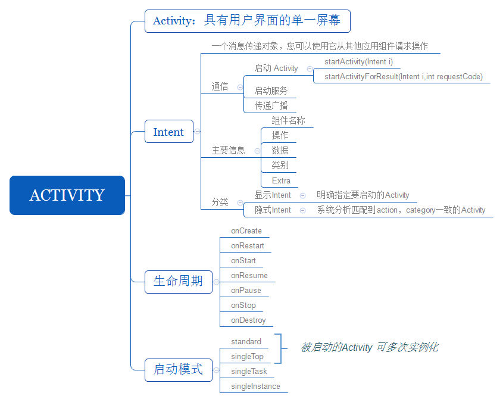

本章主要介绍Android四大组件之一，`Activity`



>注意
1. 现在创建Android应用，默认Activity继承`AppCompatActivity`类
2. 布局默认使用`ConstraintLayout`约束布局
3. 系统默认`DarkActionBar`主题

>其他
1. [< application >标签详解](https://developer.android.google.cn/guide/topics/manifest/application-element.html?hl=zh-cn)

## Activity是什么
Activity是一种可以包含用户界面的组建，主要用于和用户进行交互

## 创建Activity
### 手动创建Activity
1. 创建`class`文件并继承`AppCompatActivity`类，覆写`onCreate`方法
2. 创建后缀名为`.xml`的布局文件.并 `onCreate`方法中加载布局
3. `AndroidManifest.xml`文件中注册

### 取消标题栏
* Java代码实现
```java
if (Build.VERSION.SDK_INT >= Build.VERSION_CODES.KITKAT) {
    Objects.requireNonNull(getSupportActionBar()).hide();
}
```
>注意：上面这段代码需要在`setContentView()`方法之前执行

* 主题配置文件(style.xml)修改，并引用该主题
```xml
<style name="AppTheme.NoActionBar">
    <item name="windowActionBar">false</item>
    <item name="windowNoTitle">true</item>
</style>
```
## Intent
[Intent](https://developer.android.google.cn/guide/components/intents-filters.html?hl=zh-cn) 是一个消息传递对象，您可以使用它从其他应用组件请求操作。
Intent 可以通过多种方式促进组件之间的通信，但其基本用例主要包括以下三个：
* 启动 Activity
* 启动服务
* 传递广播

### 主要信息
* 组件名称：要启动的组件名称（可选项）。如果没有组件名称，则 Intent 是隐式的，且系统将根据其他 Intent 信息（例如，操作、数据和类别）决定哪个组件应当接收 Intent。
* 操作：指定要执行的通用操作（例如，“查看”或“选取”）的字符串。
* 数据：引用待操作数据和/或该数据 MIME 类型的 URI（Uri 对象）。提供的数据类型通常由 Intent 的操作决定。

    * android:scheme：指定数据的协议部分，如：htt
    * android:host：指定数据的主机部分，如：www.baidu.com
    * android:port：指定数据的端口部分
    * android:mimeType：指定可以处理的数据类型，允许使用通配符的方式进行指定
* 类别：一个包含应处理 Intent 组件类型的附加信息的字符串。 您可以将任意数量的类别描述放入一个 Intent 中，但大多数 Intent 均不需要类别。
* Extra：携带完成请求操作所需的附加信息的键值对。

### 显示Intent
```java
Intent(Context packageContext,Class<?> cls);
```
参数一：提供一个启动Activity的Context，Activity可以直接使用`this`  
参数二：指定目标Activity

### 隐式Intent
指定action
```java
Intent(String action);
```
每个Intent中只能指定一个action，但却能指定多个category，如果没有指定category，系统默认匹配`android.intent.category.DEFAULT`的category  
更多的隐式Intent用法可参考[官网提供示例](https://developer.android.google.cn/guide/components/intents-filters.html?hl=zh-cn#Receiving)

## 生命周期

### 返回栈
Activity是可以层叠，Android使用任务（Task）来管理Activity，一个任务就是一组存放在栈里的Activity的集合，这个栈也被称作返回栈。
栈是先进后出的数据结构
### 活动状态
Activity 基本上以三种状态存在：
* 继续：此 Activity 位于屏幕前台并具有用户焦点。（有时也将此状态称作“运行中”。）
* 暂停：另一个 Activity 位于屏幕前台并具有用户焦点，但此 Activity 仍可见。也就是说，另一个 Activity 显示在此 Activity 上方，并且该 Activity 部分透明或未覆盖整个屏幕。
* 停止：该 Activity 被另一个 Activity 完全遮盖（该 Activity 目前位于“后台”）。 已停止的 Activity 同样仍处于活动状态

### 生命周期


### 启动模式
* standard：默认值。系统始终会在目标任务中创建新的 Activity 实例并向其传送 Intent。
* singleTop：如果目标任务的顶部已存在一个 Activity 实例，则系统会通过调用该实例的 onNewIntent() 方法向其传送 Intent，而不是创建新的 Activity 实例。
* singleTask：系统在新任务的根位置创建 Activity 并向其传送 Intent。 不过，如果已存在一个 Activity 实例，则系统会通过调用该实例的 onNewIntent() 方法向其传送 Intent，而不是创建新的 Activity 实例。
* singleInstance：与“singleTask"”相同，只是系统不会将任何其他 Activity 启动到包含实例的任务中。 该 Activity 始终是其任务唯一仅有的成员。

“standard”或“singleTop”启动模式的 Activity 可多次实例化。 实例可归属任何任务，并且可以位于 Activity 堆栈中的任何位置。

“singleTask”和“singleInstance”Activity 只能启动任务。 它们始终位于 Activity 堆栈的根位置。此外，设备一次只能保留一个 Activity 实例 — 只允许一个此类任务。

[详细介绍](https://developer.android.google.cn/guide/topics/manifest/activity-element.html?hl=zh-cn#lmode)