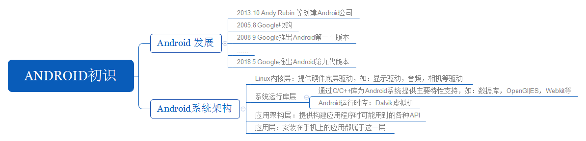

本章主要介绍



* Android的发展历程
* Android系统架构
* Android开发环境搭建及编写第一个Hello Word程序
* [关于Android Studio Logcat的官方使用教程](https://developer.android.google.cn/studio/debug/am-logcat.html?hl=zh-cn)

Log(android.util.Log)是Android中所特有的日志工具类

等级依次递增
* V — 详细（最低优先级）
* D — 调试
* I — 信息
* W — 警告
* E — 错误
* A — 断言

日志消息的格式为：
```